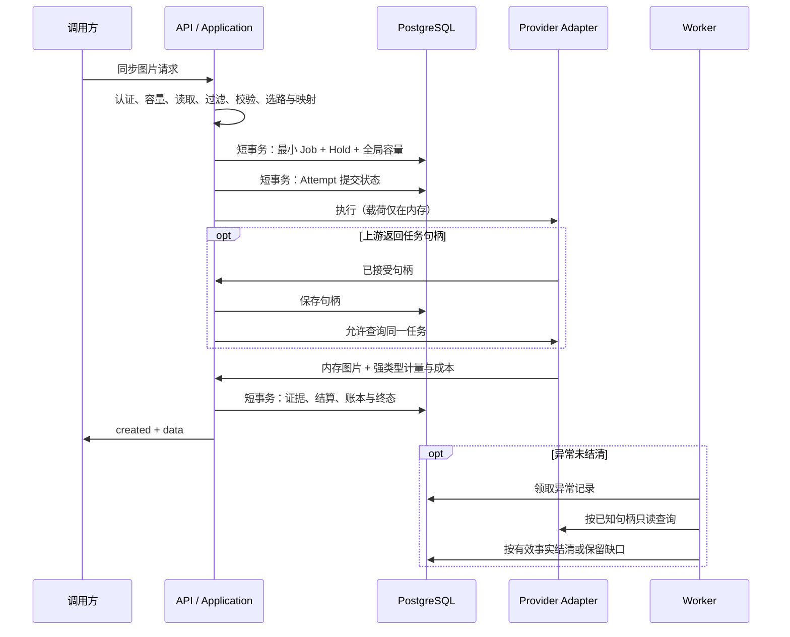

主题: 同步图片网关执行与异常对账
当前修订: v2
状态: 已接受
承接: [同步图片网关 Spec v1](../specs/0005-synchronous-image-gateway.md) §1–§8
依赖: [架构治理](../architecture.md)、[合同与映射](0005-vendor-model-contract-and-offering-mapping.md)、[定价结算](0007-pricing-floor-and-settlement.md)、[账户资金](0013-account-funds-and-reservations.md)

# 同步图片网关执行与异常对账

本 RFC 拥有直接执行编排、内存载荷与账务事实分离、Adapter 生命周期接口、执行所有权、容量、异常恢复及数据迁移机制。产品行为与错误由同步图片网关 Spec 拥有；价格公式、路由策略、余额事务和账单分别由既有设计拥有。本文的接管范围见 Spec 首段，不就地改写已批准的执行合同。

## 1. 执行数据流与模块职责

| 模块 | 拥有的职责与接口变化 |
| --- | --- |
| [API 入口](../../apps/api/src/main.rs) | Body 前认证和读取准入；JSON/multipart 解析；调用直接执行用例；有界结果发送；不读取数据库结果列、不轮询 Job。 |
| [Application](../../crates/application/src/lib.rs) | 直接执行与异常对账两个用例：编排合同、路由、占用、所有权、证据与收尾；Repository 参数不接受业务载荷。 |
| [Domain](../../crates/domain/src/lib.rs) | 最小 Job/Attempt 状态规则、证据、财务处置和容量事实；不依赖 HTTP、Tokio 或图片传输类型。 |
| [Persistence](../../crates/persistence/src/lib.rs) | 原子受理/占用、提交声明、句柄更新、幂等结算、过期所有权扫描、异常查询和元数据投影；生成载荷写入与读取接口退出新协议。 |
| [Adapter SDK](../../crates/adapter-sdk/src/lib.rs) | 只管 Provider 传输、接受阶段、查询能力、结构归一和计量/成本提取；不选路、不算平台售价、不决定占用。 |
| [AIHubMix](../../crates/adapter-aihubmix/src/lib.rs) / [APIMart](../../crates/adapter-apimart/src/lib.rs) | 共享 Client；接受事实与结果分开；有界转换和响应读取；APIMart 保存 task ID 后轮询，同步渠道不伪造可恢复句柄。 |
| [Worker](../../apps/worker/src/main.rs) | 异常记录扫描、已知句柄查询、证据收尾、账务核对与有界告警；不得领取新生成任务或读正文重发。 |

## 2. 内存输入、候选与输出

入口保留一个拥有请求内容的 `GatewayInput`，包含普通模型参数、输入参考图及 mask。解析层产出两态：公网 URL，以及 multipart 文件部件的 `Bytes`（只供同键重放比对，不参与执行）。需要字节的渠道在 wire 序列化阶段自己从公网 URL 取回字节；生成入口只收公网 URL 的合同见 [Spec 0005](../specs/0005-synchronous-image-gateway.md) §1、§3。外部 JSON 兼容行为不因内部表达改变。

小结构借用、图片字节共享 `Bytes`，配置共享 `Arc`。需要重试时保存同一份不可变执行输入，通过 body 构造函数重建 HTTP 请求体；不为每次 retry 复制整个 JSON 或图。普通参数可以保留 `serde_json::Value`，但不得用它承载全部图片并在候选循环里深拷贝。

固定流程为：认证及读取准入 → 解析 → 按适用合同过滤/已有校验 → 计算分支与轻量输入特征 → 判定候选承载能力 → 现有路由策略选中一条 → 只构造该条候选的参数映射 → 计算保底与冻结快照 → 原子受理。轻量候选包含限制、映射元数据和价格引用，不包含为所有候选准备好的图片值。选中候选映射后仍须校验实际可序列化；确定不能承载时按现有受理前回退机制处理，不能发过请求后换渠道。

Runtime Revision 作为不可变 `Arc` 缓存复用，构建该修订时编译映射索引；本机活动修订切换原子可见。在飞请求持有原修订。缓存不决定受理版本：沿用[路由设计 §7.2](0008-routing-strategy-and-caching.md#72-缓存什么)的数据库当前修订及模型/Offering/Channel 可变开关核验，失效通知丢失或其他副本仍持旧指针时也不能选旧修订或已停候选；仅不可变内容可缓存。Route Policy 按[路由设计](0008-routing-strategy-and-caching.md)仍是修订外配置，受理记录其本次策略输入与选择结果；不错误地把策略变更放入 Runtime Revision。冻结的 Channel 地址与身份不包含凭证明文，调用时凭证只从环境解析。

指纹采用流式规范化和带密钥摘要，数据库保存摘要版本、请求摘要密钥版本、稳定键摘要及请求摘要。键查找摘要用**无密钥** SHA-256（固定领域前缀与幂等键）：它只要求稳定、不可逆、所有 API 副本一致，不依赖也不轮换任何密钥；`(account_id, key_digest)` 唯一约束跨协议共用。请求指纹密钥可以按版本轮换，查到旧记录后使用记录的旧版本比对。旧记录比对使用其冻结的合同与摘要规则，先查幂等标识，再规范化；新记录使用当次合同。规范化包含平台型号、已识别参数、端点、参考图和 mask 内容，JSON 对象键排序，数组保序、字符串原值，未知字段剔除，候选截断前的 `n` 保留；缺省值按冻结合同处理。图片摘要直接遍历字节或字符串，不生成完整的 canonical 大 JSON。旧密钥保留至相应记录退出保证范围，密钥不得与 Provider 凭证混用。无法比对旧规则时拒绝执行，不能把它认作新请求。

输出分为 `ProviderOutput { response_payload, accounting_facts }`。`response_payload` 只在内存中持有 `created` 与图片；`accounting_facts` 是有界强类型的 Metering Evidence、Provider Cost、产出张数、Attempt 关联和 Provider 标识。账务 Repository 只接收后者与冻结快照，`CompleteJob.images` 和结果 JSONB 不进入新接口。

先对有界响应完成解析、结构归一和证据校验，再结算并发送。首期采用有界缓冲，不要求全流式返回或“零复制”：图片 token 可能在用量之前，提前发 HTTP 200 会无法撤回未结算成功。解析及序列化产生的短时副本纳入内存预算；大字符串所有权移动至响应，不能为账务、JobView 或缓存再 clone。响应发送以有界 body 和发送 permit 持有结果，客户端慢读不会无限保留图片。

## 3. 最小记录与事务接口

保留 Job/Attempt 标识及既有账本外键，缩减其含义为执行与财务记录，不改为新的同义领域名。词汇表的“可持久恢复”须在接受后澄清为事实与账务可恢复，而不是请求/图片可恢复。

| 记录 | 事实字段组 | 不进入记录的内容 |
| --- | --- | --- |
| Job | 账户/API Key、幂等摘要与指纹版本、冻结模型/修订/供给/Channel、价格与汇率快照、保底、状态、计量概要、产出张数、时间、平台错误码、账本关联 | native parameters、参考图/mask、结果信封、任意用户参数或自由诊断正文 |
| Attempt | 编号、执行所有者和 fencing token、阶段、任务/trace 标识、提交/接受时间、计量证据、Provider Cost、有界失败类别 | 原始 request/response/error 文本、上游图片地址、上传地址 |
| 执行容量 | Job/Channel/账户、所有权状态、到期时间及唯一关联 | 请求与响应内容 |
| 异常对账 | 原 Job/Attempt、缺失事实类别、查询调度、处置事实、人工解除关联 | Provider 结果附件、原始错误正文 |

所有接口的 SQL 输入类型排除图片与 `Value` 请求正文；价格等 JSON 如继续使用必须来自强类型冻结结构，拒绝任意扩展。数据库约束限制码、阶段、证据形态和字符串长度，财务快照大小与用户输入无关。

Repository 提供以下原子操作，具体 Rust 命名在实施时按现有模块拆分，但事务边界固定：

- `admit`：账户与键唯一性判定、资金最终检查、账户及 Channel 全局容量检查、最小 Job、Hold 和容量事实同事务提交；既有记录走重复调用投影，不再占用。
- `begin_submission`：检查未终结、执行所有权、fencing token、总期限和当前 Attempt；写 `submitting` 后提交，再授权外部发送。
- `record_acceptance`：同一 Attempt 持久化可信 task/trace ID、Provider 接受阶段及所有权；提交成功才允许后续 poll。
- `settle`：锁定 Job/Hold/账户，验证证据类型与 Attempt，按冻结快照计算的扣费结清占用、流水、每日累计、状态、成本与容量，同事务提交。已相同收尾返回已提交结果，冲突证据建案，不覆盖。
- `fail_or_reconcile`：按明确事实释放或保留占用，保存最小分类、成本缺口与查询计划；确定未受理的中间失败单独记录 Attempt，不释放原 Hold。
- `read_finalization`：按 Job/Attempt 确认提交结果；结算连接断开先确认，再进行同一幂等操作，不先假定失败。
- `offer_late_facts`：原提交者以不可伪造的同 Attempt 提交身份交付有界 task handle 或计量/成本事实，验证协议、渠道和任务关联后只写最小事实收件记录、唤醒当前所有者；允许其执行 token 已失效，但不能改所有权、重开终态或直接结算。重复事实幂等，冲突事实建案；当前收尾者重新核验后按现有端口处理，终态后晚到成本仍只走已有成本缺口规则。

任何事务都不跨 HTTP、上传、退避或 Provider 轮询。受理与结算的锁序统一，保持现有“真实收支才记流水、实际费用可超过保底额、零额不写流水、缓存只加速”的规则。缓存刷新与告警仅在提交后入有界旁路，满载丢弃可重复的缓存通知或合并告警并计数，不能让接入方耗时延长图片响应。

## 4. Adapter 生命周期接口

SDK 用进度接口或受控会话拆分当前“一次 execute 到末尾”的边界。建议接口由 `execute(input, execution_context)` 和可选 `query_accounting(handle, cost_currency, deadline, credential)` 组成（对账查询要带受理时冻结的成本币种：上游金额本身不带币种，Adapter 不假定 USD）；`execution_context` 只提供绝对期限、取消/停机状态和异步 `accepted(handle)` 确认接口，不把 Repository 或财务规则交给 Adapter。

异步 `accepted` 回调由 Application 实现，只有句柄入库确认后返回允许继续查询。APIMart 在 submit 响应解析到 task ID 后立即调用；回调失败时报告已接受及内存句柄，Application 在剩余收尾预算内尝试保存。无法保存时保留未知状态，停止后续生成副作用。上传 URL 仅用于当次内存执行，不放入 accepted handle。

Provider 失败与成功都附带可用计量、成本及接受事实；自由 `message` 改为平台分类和短白名单码，Debug 不输出 payload。HTTP 错误日志不打印 Provider body、URL 查询参数、multipart、reqwest 中可能携带敏感 URL 的原始错误串。

`query_accounting` 能力按 Adapter 声明。APIMart 用已知任务状态端点查询；AIHubMix 当前同步通路没有已验证的按 trace 恢复能力，声明不支持。查询证据须有 Provider 终态、同一任务关联和既有计费字段。只读查询与生成重试是不同操作，后者仍仅允许 `SafeBeforeAcceptance`，同候选、同冻结输入、有界退避，不做每张拆调用或运行中改道。

共享 Client 按传输策略创建并复用；相同 TLS/代理/连接池策略可以跨 Channel 复用 Client，凭证按请求设置，不放全局默认头。超时、连接池闲置、重定向和输入下载限制分别配置。参考图读取与外部下载沿用现有网络访问安全规则，重定向每跳检查，读取上限按实际字节执行，不只信任 `Content-Length`。

## 5. 状态、所有权与进程异常

Job 阶段使用 `admitted → executing → succeeded/failed/reconciliation_required`；Attempt 区分 `prepared/submitting/accepted/terminal/unknown`。它们映射到 Domain 明确枚举，存储约束与账务投影一致。Worker 不领取生成任务，`admitted` 不是可领取队列。

API Supervisor 拥有每个新执行任务、token、内存输入、permit 与 one-shot 结果通道。Handler 等待结果，断开仅关闭接收端。Supervisor 接收到关闭后：尚未提交时停止并释放；可能已提交时有限继续收尾，结果无人接收立即释放图片。后台任务总数受执行上限约束，不把 detached spawn 当作无限可靠队列。

所有权定期续约使用独立任务与轻量更新，不通过暂停 Provider future 等待心跳完成。每次提交和持久收尾检查 fencing token；续约失败或所有权失效立即触发 execution_context 取消，停止新 submit、retry 和 poll。已经收到的 submit 响应和证据仍可在独立收尾预算内解析并交给 `offer_late_facts`，禁止凭旧 token 查询或扣费。过期回收通过数据库比较并交换所有权，API/Worker 争用账务仍由 Job/Hold 唯一状态与结算约束防重。已经在网上的请求不因 token 失效而被证明取消。

| 中断位置 | 恢复依据与动作 |
| --- | --- |
| `admit` 提交前 | 事务回滚，没有执行授权；同键可重新受理。 |
| 已受理、没有 `submitting` | 旧所有权 fencing 后，过期清理确定尚未发送并释放；没有正文，不能排回生成队列。 |
| `submitting` 已提交、实际发送之前或发送中 | 两者在崩溃后不可区分，统一转对账；禁止凭“没句柄”判未受理。 |
| Provider 接受、句柄尚未保存 | 在飞 API 有界保存；崩溃后未知，不能保证恢复；没有 Provider 幂等协议不能填平此窗口。 |
| 已有句柄、尚未终态 | Worker 取得异常所有权，只查询同一任务，查询终态后结算或保留缺口。 |
| 已读有效证据、尚未持久化 | API 有界收尾；进程消失且 Provider 不可查询时证据可能丢失，建缺口，不凭价格估计收费。 |
| `settle` 提交中或已经提交、响应未发出 | 查原记录确认，至多一次实收；客户端仍可能拿不到图，适用 Spec 的交付收费边界。 |

数据库与 Provider 没有分布式事务，本设计保证资金幂等与未知不重提，不宣称 Provider 恰好执行一次。Provider 的显式幂等支持如将来启用，需另行核实保证窗口和 key 语义。

已知任务异常查询由 Worker 小批领取，`SKIP LOCKED` 只用于异常扫描，有到期索引、批次上限、查询期限、并发上限和退避。API 仍持有效所有权时 Worker 不查；接管后停止 API 新轮询。晚到结果仍可作为同 Attempt 证据，但只能经过当前收尾所有权与幂等结算，不能直接写旧 token。

## 6. 容量、期限与发送

| 资源 | 控制机制 | 生命周期 |
| --- | --- | --- |
| 每 API Key 请求速率 | Redis 原子计数脚本与 TTL；失败按现有规则放行 | 固定窗口；本机准入兜住降级负载 |
| 本机正文读取与解析 | 在 Body extractor 前 `try_acquire` permit，按字节限额读取；拒绝不排无界等待 | 从接收正文到输入移入执行；Body 慢读有超时 |
| 本机执行与峰值内存 | 固定执行槽位与字节预算；配置允许最大请求+最大响应+解析/编码副本时预留足够额度 | 覆盖执行、断开后收尾及响应发送；不能执行一结束就释放全部内存许可 |
| 账户在某模型上的并发 | PostgreSQL（按 `generation.jobs` 计数），与受理同事务、账户行锁下判定；名额取自该模型行（运营设置，模型没设时用部署缺省） | 正常执行与中间安全重试；终态或转对账释放，不代替 Hold |
| Channel 全局未决任务 | PostgreSQL 容量事实，与受理同事务更新；配置更新不抹掉已有许可 | 执行及未知接受占用；确定终态或可信人工处置才释放 |
| 本机客户端响应发送 | `try_acquire` 发送 permit，响应 body 持有预算和 permit，有界写超时 | 响应销毁或发送完成；慢客户端占用也计入预算 |

Channel 全局容量使用数据库可锁定计数/slot，唯一关联 Job，获取与释放幂等；多副本共享同一事实。租约过期只代表 API 所有权丢失，不证明上游任务结束：未知已提交任务保留 Channel 占用，避免其仍在运行时新请求越过全局上限。未知任务可能长期消耗容量，需告警和运营可信处置；不能静默 TTL 放回槽位。账户执行许可在转对账时释放，保持既有 `count_in_flight_jobs` 排除 `reconciliation_required` 的行为；资金 Hold 与 Channel 未决槽位继续保留。这三种占用分别记事实、分别原子收尾，余额足够且有渠道容量时账户可受理其他请求。

响应发送槽位在受理前预留，无法预留则拒绝尚未执行的新请求，避免生成收费后才发现本机没有返回容量。连接断开时立即取消本机响应等待许可，但内存执行许可仍由 Supervisor 持有。对账查询使用独立小池和字节预算，不能抢占全部正常执行或数据库连接。

设绝对总期限 `D`，收到头部即开始计时；为证据持久化、结算及提交确认预留 `R`。上传、下载、submit、poll 和安全 retry 最晚只使用 `D−R` 以前的预算，每一阶段同时有单次超时。达到执行截止停止新外部副作用，按已知事实收尾；同步总期限响应按 Spec §4 区分确定未提交、事实未知和已确认收费但结果交付超时，不统一写未知。受理前正文读取单独返回 408，提交前释放确认后返回 504 request_timeout；已知成功结算不能改写为未知收费。期限附近已发出的数据库 COMMIT 必须按提交未知处理，不能以 future 被取消推断回滚。

客户端发送有单独有界期限，并计入端到端观测。正常停机关闭准入，Supervisor 排空到配置的进程宽限期；残余执行事实转对账，无法写库则由到期扫描接管。部署强杀窗口须大于正常结算预算；即使强杀仍不重发已声明提交的请求。

## 7. 渐进迁移与回退边界

迁移不能假定库为空。实施前清点执行记录数量、在飞旧 Job、Hold、结果与参数存量、所有启动入口及观测/备份保留策略。使用增量迁移保留历史账本主键和外键，不重写已应用 migration。

结构先扩展协议版本、摘要、执行所有权及容量事实。历史幂等键在清理前按新的无密钥标识建立可查找摘要并移除明文；历史 `request_hash` 保留版本，旧键仍可查回原记录。原指纹源于原始调用而存量 native parameters 已经映射，不能从该列反推原请求或生成新版指纹；历史键比对使用旧摘要算法对本次内存请求计算，忽略新的过滤指纹规则。实现必须保留旧算法版本与完整输入规范，以夹具验证；无法比较的旧键安全返回冲突且禁止新执行，不因迁移变成可复用键。新受理/结算接口从第一笔新协议请求起排除 payload，旧正文列只供切换前旧协议使用。新 Adapter 和财务收尾先用假上游验证；上线切换时关闭旧生成准入、停止新 Job 排队，排空已有 Worker。同步 Provider 的旧提交未知件转对账，APIMart 有可信句柄的旧件可转只读查询；不得为了清理自动重新生成。

切换前初始化各 Channel 全局限额与存量容量：逐个核对旧 submitting/accepted/reconciliation_required Attempt，仍可能在上游执行的任务绑定保留槽位并核对 Job、Hold 与 Channel；无法可信归属的未决任务冻结涉及 Channel 新准入，直到查明。存量已超新限额时只拒绝新增，不能删槽位使计数表面合规；API/Worker 停止不等于 Provider 已停。容量核对完成且旧 API/Worker 全部停止后，启用直接执行协议；滚动部署必须有明确协议路由和禁止旧消费者领取新记录的约束，否则用维护窗口切换，不能依靠“应该不会领取”。在飞图片无法跨进程搬运；切换造成的连接中断按收费与异常合同处理。上线准入以新路径的 A1–A8、A10 证据通过为前置。

存量正文清理在旧在飞排空或转对账且财务外键核实后进行。大表分批清空、观察 WAL 与复制延迟，再删正文列、结果列及无引用队列字段；证据或 Provider Cost 中的任意 JSON/错误文本先按白名单回填再移除旧副本。审计、旧日志、副本、WAL、备份与 crash dump 的清理按实际存量制定执行记录；备份尚未自然过期时，不能宣称全量历史载荷清除完成。保留最小记录与金额历史。

破坏性清理前可以停止准入并回退到修复后的无载荷版本。正文列删除后只能回退到支持新协议且不写正文的版本，不能恢复旧 Worker 队列，也不能以数据库备份回滚覆盖期间产生的账务。需要再次提供持久执行或结果重放时必须重新设计与批准。

接受本合同后同步根工程边界、词汇表、架构索引、现有执行/运维/价格设计及 ADR-0019 的适用范围，只在各自属主写规则，不把本文全文抄入旧文档。财务 Spec 的“同键返回原请求”在同步调用上由新重复调用合同细化，金额防重语义继续有效。客户/管理员历史读取从 metadata 投影，删除对完整参数与图片结果的依赖。

## 8. 验证与性能证据

所有验证用本地假 Provider，无真实计费调用。行为证据覆盖 Spec A1–A10，并保留现有资金、合同、路由和公开同步接口回归。实施中需真实 PostgreSQL 的事务/迁移/多副本竞争进入端到端测试，其余生命周期与 Adapter 使用可控 HTTP 夹具和暂停时钟验证，不用耗时 sleep 模拟崩溃窗口。

| 验收组 | 证据切入点 |
| --- | --- |
| A1、A3 | Worker 不执行生成时 API 成功；DB query 计数无每 250ms poll；慢 Provider 期间可用池连接回归空闲；认证发生在 body 消费前。 |
| A2 | payload 标记覆盖 SQL 参数/记录、JSON evidence、trace subscriber、Redis、审计、告警与错误；生产观测配置静态核查；存量清理单独验收。 |
| A4、A7 | 同键并发和不同 key 资金竞争、原修订指纹、价格切换、指纹密钥轮换中及轮换后同键去重、中间 retry 保留 Hold/容量、重复 settle、COMMIT 确认未知、正文慢读/未提交截止/已确认结算交付截止、客户端断开与慢发送。 |
| A5、A6 | 各提交窗口故障注入、句柄保存 barrier、所有权 fencing、接管后晚到句柄/证据登记与停止旧 poll、API/Worker 并发收尾、不可查询同步渠道、响应超限但可能有费用。 |
| A8 | 多副本容量竞争、转对账释放账户许可但保留 Hold/Channel槽位、跨副本发布/停用且缓存通知丢失、Redis 故障原子计数、本机执行和发送预算、总期限覆盖上传/submit/poll/retry、告警端故障不延长响应。 |
| A9、A10 | 旧库包含成功/失败/未知/占用数据时增量迁移，验证账本与用量投影、未知句柄处理、旧未知任务初始化 Channel 槽位后与新请求竞争容量、旧程序禁止领新协议、历史正文清理与回退限制。 |

性能比较固定同一假上游延迟、响应大小、数据库与硬件，测单候选和多候选、URL 小响应与最大合法 base64、多个 API 副本、慢客户端及容量拒绝。记录吞吐、网关新增延迟 p50/p95/p99、Provider 耗时、峰值 RSS、执行/读取/发送在飞数、SQL 次数与耗时、连接等待、WAL 字节/请求及对账延迟。

必须达到的结构性结果：SQL 次数不随 Provider 等待时间增长；同一响应从 1MiB 增至上限时账务行大小不随图片增长；候选增多不产生逐候选大图副本；共享 Client 有连接复用证据；最大合法输入/输出与慢发送下 RSS 落在预先配置的预算内，超载拒绝而不形成无界队列。吞吐倍数与具体延迟阈值须用整改前基线与部署目标确定，不虚构固定提升百分比。
